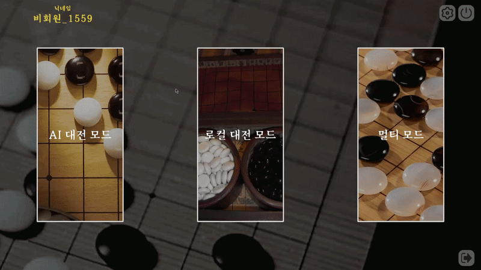

# 오목 대전 — 실시간 멀티플레이 보드게임 (Client)

Unity ↔ Node.js 서버 ↔ MongoDB로 이어지는 실시간 멀티플레이 통신 구조를 직접 구축한 온라인 오목. AI·로컬·멀티·아케이드 4개 모드 제공

> 🏆 **멋쟁이사자처럼 부트캠프 3인 팀 프로젝트 (2025.09, 2주) — 22팀 중 3위**

📔 **[프로젝트 상세 문서 (Notion)](https://app.notion.com/p/3741a1efbfe38149b3b6c5bacd70542c)** · 🖥️ **[서버 레포 (Node.js)](https://github.com/libo-liti/Omok-Server)**

---

## 팀 구성 / 본인 담당

> 🙋 3인 팀 — **본인: 서버·네트워크·계정·아케이드 모드 담당**

| 구분 | 내용 |
|---|---|
| **본인** | 실시간 멀티플레이 통신(Socket.IO) 클라이언트 — 방 생성·매칭, 턴·게임 상태 동기화 / UnityWebRequest 기반 회원가입·로그인 / '상대 수 예측' 아케이드 모드 기획·구현 |
| 팀원 | AI 모드(미니맥스·알파-베타 가지치기), 로컬 대전, UI/UX 디자인 |

> ⚠️ 코드 중심 포트폴리오 레포입니다. 에셋·씬은 제외되어 빌드는 불가하며, 플레이 영상은 노션에서 확인할 수 있습니다.

---

## 핵심 구현

- **상태 패턴 기반 게임 로직** — 턴마다 입력 주체(사람·AI·네트워크)가 달라지는 점에 주목, `BasePlayerState`를 구현한 상태 객체(`PlayerState`·`AIState`·`MultiplayerState`)를 교체하는 구조. 새 모드 추가 시 상태 클래스만 더하면 되는 확장 구조 — 아케이드 모드가 실제로 이 위에 얹힘
- **실시간 동기화** — 서버가 한 클라이언트의 착수를 방 전체에 브로드캐스트하는 서버 권위 구조로 상태 일관성 유지
- **계정 시스템** — UnityWebRequest REST API 호출, 정규식 이메일 검증, 게스트 모드

## 대표 문제 해결 — 크로스 스레드 충돌로 이모티콘 미표시

- **현상**: 멀티플레이 시 상대가 보낸 이모티콘이 화면에 표시되지 않음
- **원인**: Socket.IO 수신 이벤트는 백그라운드 스레드에서 발생하는데, 핸들러가 Unity UI를 직접 조작 → Unity의 트랜스폼·UI API는 메인 스레드 전용이라 크로스 스레드 오류
- **해결**: 소켓 이벤트를 `OnUnityThread`로 등록해 핸들러가 메인 스레드에서 실행되도록 보장 — 수신 이벤트를 메인 스레드 큐를 거쳐 처리
- **근거**: 멀티플레이에서 반복적으로 만나는 패턴을 구조적으로 해결 — 비동기 통신 이벤트는 그대로 UI에 반영하지 않는다

📄 코드: [`MultiplayController.cs`](Assets/02.%20Scripts/Network/MultiplayController.cs)

## 주요 코드 안내

| 파일 | 내용 |
|---|---|
| `MultiplayController.cs` | Socket.IO 이벤트 수신·메인 스레드 바인딩 |
| `AuthenticationManager.cs` | REST API 회원가입·로그인 |
| `GameLogic.cs` / `~State.cs` | 상태 패턴 게임 로직 |
| `PlayerState.cs` | '상대 수 예측' 아케이드 모드 |

---

📱 **Contact** — 000525jh@gmail.com · [전체 포트폴리오 (Notion)](https://app.notion.com/p/d861a1efbfe382c9ab55010f549b1cf3)
